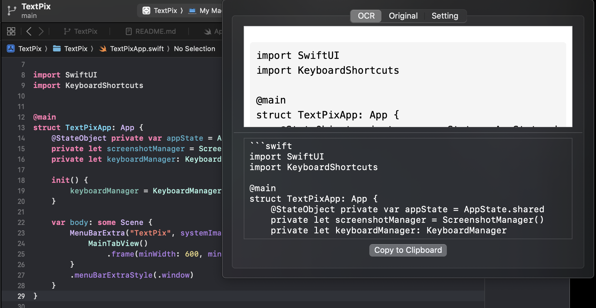

# TextPix

- TextPix 是一款轻量级的 macOS 菜单栏应用, 利用大语言模型对屏幕上的图片进行 OCR 识别, 并将结果以 Markdown (支持数学公式) 格式输出
- 项目建立之初就是为了以 **低成本取代 mathpix**
## 核心功能

- 一键截图: 支持系统截图交互, 快捷键 (默认 ⌘+⇧+2) 快速唤出  

- 智能识别: 将图片中的文字、列表、块方程、行内公式等完整识别并转为 Markdown  

- 实时预览: 内置 Markdown+KaTeX 渲染视图, 渲染效果与最终输出一致  

- 文本编辑: 下方可直接编辑识别结果  

- 复制分享: 手动点击「Copy to Clipboard」, 或开启自动复制, 一键粘贴到任意应用  

- 自定义配置: 在「Setting」页可设置 AI 接口地址、模型、API Key、系统提示词及快捷键  

   >  模型建议使用 gemini-flash  API 地址 : `https://generativelanguage.googleapis.com/v1beta/openai/chat/completions`  
   >  国内模型使用 qwen-2.5-vl 效果还可以，API获取入口 [阿里云百炼](https://bailian.console.aliyun.com/)  
   >  gemini-flash 配置案例:  

- 

- 

## 系统要求

- macOS 13.5 及以上  

## 快速上手

1. 前往「Setting」页面, 填写或修改:   
   - API 地址 (Endpoint)   
   - 模型名称 (Model)   
   - API 密钥 (API Key)   
   - 系统提示词 (System Prompt)   
2. 按下截图快捷键, 即可体验从截图到 Markdown 输出的全流程便捷操作。  
